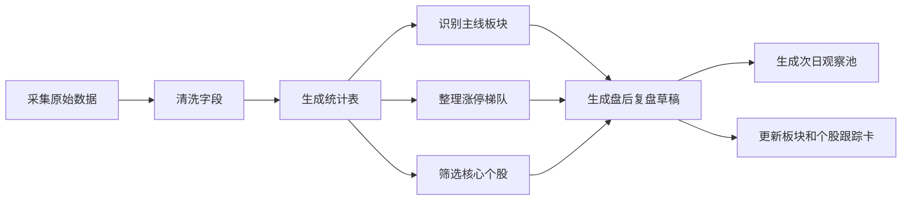

# 数据源与复盘产出方案

> 更新时间：2026-06-01  
> 目标：把 A 股每日复盘需要的数据拆清楚，先跑通“能用的一版”，再逐步加深。

## 一句话结论

第一版建议用 **自在量化 / zzshare 做短线复盘主源**，用 **AkShare 补基础行情**，用 **东方财富补板块和资金口径**，用 **Tushare 或 AShareHub 做稳定备份和历史数据沉淀**。

这样最后可以自动生成：

- 每日盘后复盘草稿
- 涨停原因表
- 连板梯队
- 热门板块排行
- 次日观察池
- 板块跟踪卡
- 个股跟踪卡
- 周度复盘初稿

## 1. 数据源总表

| 数据源 | 定位 | 能拿什么 | 最适合解决什么问题 | 第一版优先级 |
|---|---|---|---|---|
| 自在量化 / zzshare | 短线复盘主源 | 涨停股、涨停原因、热门板块、市场情绪、龙虎榜、同花顺热度、板块排名 | 今天强在哪里，为什么涨，情绪到哪一步 | 必接 |
| AkShare | 免费行情底座 | 指数、个股行情、历史 K 线、分时、板块、资金、热度、互动问答等 | 补基础行情和公开数据 | 必接 |
| 东方财富 | 板块和资金补充源 | 行业/概念板块、板块资金、个股资金、人气榜、数据中心页面 | 判断资金偏向和板块热度 | 必接 |
| Tushare | 稳定历史数据源 | 涨跌停/炸板、日线、指数、交易日历、行业分类、概念板块、财务、宏观 | 做长期数据沉淀和历史回测 | 第二阶段 |
| AShareHub | 统一 API 备选 | 日线、基本面、涨跌停、龙虎榜、融资融券、北向、概念、筹码等 | 想少维护爬虫时，用统一 REST API | 第二阶段 |
| 巨潮资讯 / 交易所公告 | 事件解释源 | 公司公告、监管公告、互动问答 | 解释个股异动和风险事件 | 第二阶段 |

## 2. 自在量化 / zzshare

入口：

- https://quant.zizizaizai.com/review/uplimit/reason
- https://pypi.org/project/zzshare/

已确认页面接口：

- `https://api.zizizaizai.com/v3/api/review/uplimit/reason?date1=日期&page=页码&page_size=每页板块数`
- 这个接口按板块分页，每页返回若干个板块，每个板块下有 `stocks`。

### 可获取数据

| 类别 | 典型接口 | 具体内容 | 复盘用途 |
|---|---|---|---|
| 涨停原因页面 | `/v3/api/review/uplimit/reason` | 板块、个股、代码、涨停时间、连板描述、封单额、成交额、流通市值、换手、涨停原因 | 生成涨停原因总表 |
| 涨停复盘 | `uplimit_hot` | 当日涨停热门板块 | 找当天主线 |
| 涨停复盘 | `uplimit_stocks` | 涨停股票列表、连板信息 | 生成涨停池和梯队 |
| 涨停原因 | `stock_uplimit_reason` | 个股涨停原因 | 写清楚个股为什么涨 |
| 情绪热度 | `market_sentiment` | 市场情绪指标 | 判断强、弱、修复、退潮 |
| 情绪趋势 | `sentiment_trend` | 情绪变化趋势 | 判断情绪是否延续 |
| 热度排行 | `ths_hot_top` | 同花顺热度前排 | 看市场关注度 |
| 板块分析 | `plates_list` / `plates_rank` | 行业、概念板块列表和排名 | 做板块强弱排序 |
| 板块成分 | `market_plate_stocks` | 板块内个股 | 找龙头、中军、后排 |
| 龙虎榜 | `lhb_list` / `lhb_detail` | 龙虎榜列表和详情 | 盘后看资金性质 |
| 资金流 | `stock_moneyflow` / `market_mf` | 个股资金流、市场分钟资金 | 辅助判断，不单独下结论 |

### 在系统里的角色

这是短线复盘的核心数据源，重点负责：

- 今天哪些板块最强
- 哪些股票涨停
- 连板高度是多少
- 每只涨停股的原因是什么
- 情绪是在回暖、分歧还是退潮

## 3. AkShare

入口：

- https://akshare.akfamily.xyz/data/stock/stock.html

### 可获取数据

| 类别 | 具体内容 | 复盘用途 |
|---|---|---|
| 指数行情 | 上证、深成指、创业板、科创 50、北证 50 等 | 判断市场大环境 |
| 个股实时行情 | 全市场 A 股实时快照 | 统计涨跌家数、成交额前排 |
| 个股历史行情 | 日线、周线、月线、复权价格 | 做趋势和位置判断 |
| 分时数据 | 近期分钟线、分笔数据 | 盘中异动和个股回看 |
| 估值和基础数据 | 市值、PE、PB 等 | 区分大票、小票、估值位置 |
| 热度数据 | 东方财富人气、关键词等 | 看市场关注点 |
| 互动数据 | 互动易、上证 e 互动 | 补个股题材解释 |

### 在系统里的角色

AkShare 是免费底座，重点负责：

- 市场基础数据
- 个股价格和成交
- 指数表现
- 备用数据校验

它适合先接，因为上手快、覆盖广，但要接受部分接口偶尔变动或失效。

## 4. 东方财富

入口：

- https://data.eastmoney.com/
- https://data.eastmoney.com/bkzj/gn.html

### 可获取数据

| 类别 | 具体内容 | 复盘用途 |
|---|---|---|
| 行业板块 | 行业涨跌、成交、资金 | 判断行业轮动 |
| 概念板块 | 概念涨跌、成交、资金 | 判断题材热度 |
| 板块资金 | 主力净流入、净流出 | 辅助判断资金偏好 |
| 个股资金 | 个股主力资金 | 看核心股是否被资金关注 |
| 人气排行 | 热门个股、股吧热度 | 判断市场讨论热度 |
| 数据中心 | 龙虎榜、融资融券、大宗交易等页面 | 补充盘后信息 |

### 在系统里的角色

东方财富适合补“资金”和“板块口径”：

- 哪些板块涨得好
- 哪些板块有资金流入
- 板块强度是不是只有一两只股票撑着
- 热门股是否有市场关注度支撑

资金流不要迷信，只作为辅助证据。

## 5. Tushare

入口：

- https://tushare.pro/document/2?doc_id=298

### 可获取数据

| 类别 | 具体内容 | 复盘用途 |
|---|---|---|
| 涨跌停/炸板 | 涨停、跌停、炸板、首次封板、最后封板、开板次数、连板数、封单金额 | 做情绪统计和涨停质量分析 |
| 日线行情 | 开高低收、成交量、成交额 | 做历史沉淀 |
| 指数数据 | 指数日线、分钟线、成分和权重 | 做市场环境判断 |
| 行业分类 | 申万、中信等行业分类 | 做统一行业口径 |
| 概念板块 | 同花顺、东方财富、通达信概念 | 做题材映射 |
| 交易日历 | A 股交易日 | 自动判断是否需要生成日报 |
| 财务数据 | 利润表、资产负债表、现金流、业绩预告 | 做中线和基本面补充 |
| 宏观数据 | CPI、PPI、PMI、社融、利率等 | 做大环境观察 |

### 在系统里的角色

Tushare 适合当“稳定数据仓库”：

- 需要长期历史数据时用它
- 需要统一字段和较高稳定性时用它
- 需要做回测、统计、横向比较时用它

缺点是部分接口需要积分，不一定适合第一天就全接。

## 6. AShareHub

入口：

- https://asharehub.com/zh/docs

### 可获取数据

| 类别 | 具体内容 | 复盘用途 |
|---|---|---|
| 行情 | 日线、指数、技术因子 | 做市场和个股基础判断 |
| 涨跌停 | 涨跌停统计 | 做情绪复盘 |
| 龙虎榜 | 龙虎榜数据 | 看盘后资金性质 |
| 融资融券 | 融资余额、融券余额 | 做中期情绪辅助 |
| 北向资金 | 北向流入、持股 | 看外资方向 |
| 概念板块 | 概念、成分、行业分类 | 做板块分析 |
| 筹码分布 | 个股筹码数据 | 做趋势股位置辅助 |
| 财务和业绩 | 财报、预告、快报、分红 | 做基本面补充 |

### 在系统里的角色

AShareHub 是“少折腾版统一 API”备选：

- 如果后面不想维护太多页面爬虫，可以考虑它。
- 如果 `zzshare + AkShare + 东方财富` 已够用，第一阶段可以先不接。

## 7. 巨潮资讯 / 交易所公告

### 可获取数据

| 类别 | 具体内容 | 复盘用途 |
|---|---|---|
| 公司公告 | 重大事项、业绩、减持、增持、重组、停复牌 | 解释个股异动 |
| 监管公告 | 问询函、关注函、处罚 | 识别风险 |
| 互动问答 | 公司回应业务、订单、题材 | 验证题材真实性 |

### 在系统里的角色

它不负责行情统计，负责回答：

- 这个股票涨，是不是有公告原因
- 这个题材是不是公司自己确认过
- 有没有风险公告不能忽略

## 8. 每日最小采集包

第一版每天只抓这些，先把复盘跑顺：

| 模块 | 字段 |
|---|---|
| 市场环境 | 主要指数涨跌幅、成交额、涨跌家数 |
| 情绪强弱 | 涨停数、跌停数、炸板数、炸板率、连板高度 |
| 涨停池 | 股票、代码、涨停时间、连板数、所属板块、涨停原因 |
| 板块强度 | 热门板块、板块涨幅、板块成交、板块内涨停数 |
| 核心个股 | 龙头、中军、趋势股、成交额前排 |
| 风险观察 | 跌停股、炸板股、高位回落股 |
| 资金辅助 | 板块资金、个股资金、龙虎榜 |
| 热度辅助 | 同花顺热榜、东方财富人气榜 |

## 9. 数据到结果的流程

## 10. 最终能完成什么

### 1. 每日盘后复盘

自动生成一篇结构化草稿：

- 今天市场强弱
- 成交额是放量还是缩量
- 涨跌家数是否支持指数表现
- 涨停、跌停、炸板情况
- 最强板块和核心个股
- 情绪阶段判断
- 明日观察方向

### 2. 涨停原因总表

每天生成一张表：

| 股票 | 代码 | 连板 | 所属板块 | 涨停原因 | 首封时间 | 炸板次数 | 明日观察 |
|---|---|---|---|---|---|---|---|

用途：

- 快速看懂今天为什么涨
- 找同一题材里的核心票
- 做次日观察池

### 3. 板块强度榜

每天生成一张表：

| 板块 | 涨幅 | 涨停数 | 核心个股 | 成交变化 | 判断 |
|---|---|---|---|---|---|

用途：

- 判断主线、支线、一日游
- 观察资金是聚焦还是发散
- 更新板块跟踪卡

### 4. 连板梯队

自动整理：

- 最高板
- 4 板以上
- 3 板
- 2 板
- 首板

用途：

- 判断短线情绪高度
- 看接力是否活跃
- 识别高位风险

### 5. 次日观察池

按优先级输出：

| 优先级 | 方向/个股 | 关注原因 | 触发条件 | 风险信号 |
|---|---|---|---|---|

用途：

- 明天先看什么
- 什么条件才算走强
- 什么情况直接放弃

### 6. 周度复盘

每周自动汇总：

- 本周主线变化
- 哪些板块从启动到发酵
- 哪些板块退潮
- 本周最强个股和亏钱方向
- 下周重点观察方向

## 11. 第一版建设顺序

建议按这个顺序做：

1. 接 `zzshare`：先拿涨停股、涨停原因、热门板块、情绪。
2. 接 AkShare：补指数、全市场行情、成交额、涨跌家数。
3. 接东方财富：补板块资金和人气排行。
4. 生成每日原始数据文件。
5. 生成每日复盘草稿。
6. 生成次日观察池。
7. 后面再接 Tushare 或 AShareHub 做历史库。

## 12. 风险和边界

- 数据用于复盘研究，不用于自动下单。
- 涨停原因和题材归因需要允许人工修正。
- 资金流只能作辅助，不单独作为结论。
- 页面数据可能变化，采集失败时要保留错误日志。
- 所有日报要记录数据来源和采集时间。
