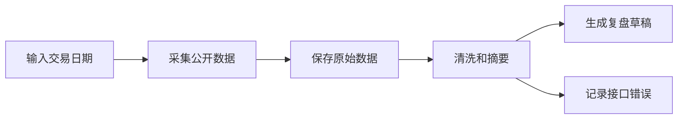

# 架构说明

## 目标

这个项目先解决一件事：每天把 A 股复盘需要的公开数据自动抓下来，并整理成可读的复盘草稿。

项目不做自动交易，不做收益承诺，也不把数据分析包装成确定结论。

## 总体流程



## 模块分工

| 模块 | 位置 | 职责 |
|---|---|---|
| 核心处理 | `tools/a_review/core.py` | 日期规范化、URL 构造、接口解析、去重、板块汇总、复盘草稿生成 |
| 每日采集 | `tools/collect_daily_data.py` | 按交易日抓取主要数据，并写入 `data/` |
| 涨停原因采集 | `tools/collect_quant_reason.py` | 单独抓取自在量化涨停原因 |
| 测试 | `tools/tests/` | 验证数据处理逻辑 |
| 自动运行脚本 | `scripts/run_daily.sh` | 给定日期后一键运行每日采集 |
| 数据源登记表 | `config/data_sources.json` | 维护哪里取什么数据，以及输出到哪里 |

## 数据源分工

| 数据源 | 当前用途 | 状态 |
|---|---|---|
| 自在量化 | 涨停原因、热门板块、核心个股实时行情、交易日历 | 已接入 |
| AkShare / 新浪源 | 全市场 A 股行情、指数行情 | 已接入 |
| AkShare 涨停池 | 涨停池、跌停池 | 已接入 |
| 东方财富 push2 | 行业、概念、全市场兜底 | 当前网络下不稳定 |

## 数据目录

```text
data/
├── raw/日期/
│   ├── metadata.json
│   ├── errors.json
│   ├── quant_uplimit_reason_pages.json
│   ├── quant_uplimit_reason_rows.json
│   ├── quant_market_real_core.json
│   ├── akshare_a_spot_sina.json
│   ├── akshare_index_spot_sina.json
│   ├── akshare_zt_pool.json
│   └── akshare_zt_pool_dtgc.json
├── processed/日期/
│   └── market_breadth_summary.json
└── reports/日期/
    └── review_draft.md
```

## 错误处理

每日采集脚本默认不因为某个可选接口失败而中断。

失败会写入：

```text
data/raw/日期/errors.json
```

如果希望任一接口失败时直接返回非零状态，可以加：

```bash
--strict
```

## 后续扩展

推荐按这个顺序继续做：

1. 接入市场情绪接口。
2. 给行业、概念板块增加非东方财富来源。
3. 把草稿自动写入 `01-每日复盘/`。
4. 生成次日观察池。
5. 增加周度汇总。
